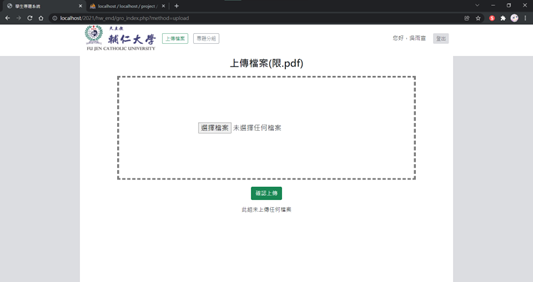
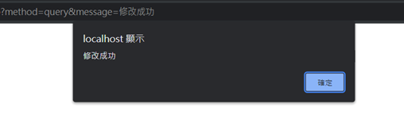

# 一、介面畫面

### 0 各個權限之導覽列

1. 學生導覽列

2. 老師導

3. 管理者覽列

說明：
登入使用SESSION存取使用者權限、姓名，在登出旁邊有顯示使用者名字，若SESSION被自動刪除後，將會導回登出程式，並自動回到登入頁面。

### 1.1 登入

介面說明：
依照登入帳號之所屬身分，分別進入不同的頁面。學生身分登入後進入專題上傳頁面(2.1)；老師身分登入後進入專題評分查看頁面(4.1)；管理者身分登入後進入查看帳號頁面(5.1)。若帳號不存在或密碼錯誤會出現錯誤訊息。

## 學生
### 2.1專題上傳

介面說明：
只限上傳pdf檔案，上傳檔案後下面將會顯示上傳紀錄(上傳檔名、上傳時間、上傳者帳號)。若該小組未上傳任何檔案，則底下也會提醒。

介面說明：
上傳成功後，會顯示提示，並且回到專題上傳頁面；若重複上傳檔案，則會提醒；若有錯誤訊息也會顯示。按下確認後會回到專題上傳頁面(2.1)。

### 3.1新建專題組別(分組首頁)

介面說明：
若登入帳號不存在於分組名單，專題分組頁面則自動新增專題組別，並新增組員，學號及姓名則預設登入者帳號與姓名。按下確認新增後建立一新組別，並將登入者加入此分組名單，並回到檢視專題組員頁面(3.1)。

### 3.2查看組員

介面說明：
若帳號存在於分組名單中，專題分組頁面則預設顯示與登入者同組的組員，顯示組員學號、所屬科系、姓名。

### 3.3 新增組員

介面說明：
輸入欲新增組員之個人資料。新增後會有提醒訊息(新增成功/新增失敗)，按下確認後回到分組首頁(查看組員)。
若新增的學號已存在資料庫，則會出現錯誤顯示。

### 3.4 修改組員

介面說明：
可修改欲修改組員之個人資料，將會代入資料庫已有資料，學號不予修改，因所屬學院不寫入資料庫，因此修改的預設選項為預設。修改後會有提醒訊息(修改成功/修改失敗)，按下確認後回到分組首頁(查看組員)。

### 3.5 刪除組員

介面說明：
刪除後會有提醒訊息(刪除成功/刪除失敗)，按下確認後回到分組首頁(查看組員)。

## 老師
### 4.1 專題評分查看

介面說明：
會將檔名去除附檔名顯示，以及該專題小組的組員(以”、”分開)、檔案上傳時間、分數、編輯。其中若未評分則會顯示”未評分”，並編輯底下顯示評分按鈕；有則顯示評分分數，並顯示修改按鈕。

### 4.2 專題分數新增

介面說明：
新增專題分數，點選下載可以下載該專題檔案。新增後則會有提醒訊息(新增成功/新增失敗)，按下確認回到專題評分查看頁面(4.1)。

### 4.3專題分數修改

介面說明：
可修改分數，分數將會代入資料庫已有資料。修改後會有提醒訊息(修改成功/修改失敗)，按下確認回到專題評分查看頁面(4.1)。

## 管理者
### 5.1 查看帳號

 

介面說明：
查看所有帳號，並可以於右上選擇要查看的身分。

### 5.2 新增帳號

介面說明：
新增帳號，若帳號重複，則會出現錯誤訊息。新增後會有提醒訊息(新增成功/新增失敗)，按下確認回到查看帳號頁面(5.1)。

### 5.3 修改帳號

介面說明：
可修改欲修改帳號之資料，將會代入資料庫已有資料，帳號不予修改。修改後會有提醒訊息(修改成功/修改失敗)，按下確認回到查看帳號頁面(5.1)。

### 5.4 刪除帳號

介面說明：
刪除後會有提醒訊息(刪除成功/刪除失敗)，按下確認回到查看帳號頁面(5.1)。

### 6.1 專題一覽

介面說明：
可以查看已上傳組別之所有老師給予的平均成績，若未有老師給出成績則會出現空值。點選查看可以查看各個老師給予的成績(6.2)。

### 6.2 專題所有分數查看

介面說明：
表格上顯示選擇的該專題檔案名稱(去掉附檔名)，表格則顯示各個評分老師的資料以及給予的成績。

# 二、資料庫
1. 關聯表

*紅色為資料庫中的表名稱/欄位名稱，PK為主鍵、FK為外來鍵。

2. accountlist 資料表

3. grouplist

4. memberlist

5. uploadfile

# 三、系統流程

